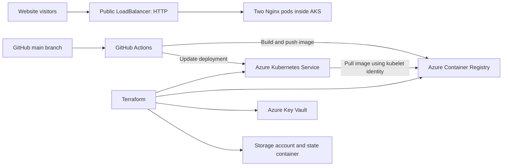

# Emrys Infrastructure

An Azure infrastructure and application delivery portfolio project. Terraform defines the cloud resources, Docker packages the **Novohearth Homes** website with Nginx, and Kubernetes runs the application on Azure Kubernetes Service (AKS).

The repository brings together infrastructure as code, managed identities, container delivery, and automated application releases through GitHub Actions.

## Architecture



All Azure resources belong to a Terraform-managed resource group. Key Vault and storage are provisioned infrastructure components; the static website does not read secrets from Key Vault. The remote Terraform backend is currently commented out.

## What is included

| Area | Implementation |
| --- | --- |
| Infrastructure | Azure resource group, AKS, ACR, Key Vault, and Azure Storage |
| Identity and access | System-assigned AKS identity, kubelet `AcrPull` role, and Key Vault Secrets Officer assignment for the Terraform caller |
| Container | Static HTML, CSS, and JavaScript served by `nginx:alpine` |
| Kubernetes | Two replicas, rolling updates, resource requests and limits, readiness and liveness probes |
| Networking | Public Kubernetes LoadBalancer service on port 80 |
| Delivery | GitHub Actions builds a commit-tagged image, pushes to ACR, and updates an existing AKS deployment |

## Novohearth Homes website

The sample application is a responsive real estate portfolio website featuring:

- A **“Find your next chapter.”** hero and viewing links.
- Six illustrative property listings with badges and pound prices.
- Combined maximum-budget and minimum-bedroom filters.
- A live results count, empty state, and filter reset controls.
- Mobile navigation, service information, and illustrative testimonials.
- A practice contact form with browser-side validation; it does not send messages.

Property photos load from Unsplash and require an internet connection.

## Repository structure

```text
.
|-- .github/workflows/Build-ci.yml  # Build and release workflow
|-- Novohearth-Homes-site/
|   |-- assets/                    # Logo and favicon
|   |-- index.html                 # Website content and listings
|   |-- styles.css                 # Responsive presentation
|   |-- app.js                     # Filters, navigation, and form
|   |-- dockerfile                 # Nginx container image
|   `-- nginx.conf                 # Static file serving and caching
|-- k8s/
|   |-- deployment.yaml            # Application pods and health probes
|   `-- service.yaml               # Public HTTP service
|-- terraform/
|   |-- provider.tf                # Provider requirements
|   |-- variables.tf               # Configurable inputs
|   |-- local.tf                   # Resource naming
|   |-- main.tf                    # Resource group
|   |-- AKS.tf                     # Kubernetes cluster
|   |-- ACR.tf                     # Container registry
|   |-- keyvault.tf                # Key Vault
|   |-- storage.tf                 # Storage and state container
|   |-- rbac.tf                    # Role assignments
|   |-- backend.tf                 # Commented remote backend example
|   `-- output.tf                  # Resource names and identifiers
`-- README.md
```

## Run locally

Open `Novohearth-Homes-site/index.html` in a browser. No package installation or frontend build is required.

Alternatively, with Docker running, execute these commands from the repository root:

```bash
docker build -f Novohearth-Homes-site/dockerfile -t novohearth-homes-site:local ./Novohearth-Homes-site
docker run --rm --name novohearth-local -p 8080:80 novohearth-homes-site:local
```

Open [localhost:8080](http://localhost:8080). Stop the container from another terminal with `docker stop novohearth-local`.

## Azure setup

The commands below use **Bash or Git Bash** and start at the repository root. Install Azure CLI, Terraform, Docker, and kubectl before proceeding. Azure resource creation incurs charges and requires permissions to create resources and role assignments.

### 1. Sign in and review configuration

```bash
az login
az account set --subscription "<subscription-id>"
export ARM_SUBSCRIPTION_ID="$(az account show --query id -o tsv)"
```

Review [terraform/variables.tf](terraform/variables.tf) before provisioning. Current defaults are:

| Input | Default |
| --- | --- |
| Project name | `nimbus` |
| Region | `UK South` |
| AKS nodes | `1` |
| AKS VM size | `Standard_D2s_v4` |
| ACR SKU | `Basic` |
| Key Vault SKU | `standard` |
| Storage replication | `LRS` |

ACR, storage, and Key Vault names include a generated suffix. Change inputs through a local variable file or Terraform command-line options as needed. Variable files are excluded from Git.

### 2. Provision infrastructure

```bash
terraform -chdir=terraform init
terraform -chdir=terraform fmt -check
terraform -chdir=terraform validate
terraform -chdir=terraform plan -out=tfplan
terraform -chdir=terraform apply tfplan
```

Keep the generated plan local: it may contain sensitive values and is not covered by the current `.gitignore`. Remove it after use.

The configuration currently uses local state. Although Terraform creates a private `tfstate` storage container, it does not automatically use that container as its backend. To enable remote state, replace the commented example in `terraform/backend.tf` with a valid `terraform { backend "azurerm" { ... } }` block using the actual resource names and appropriate backend authentication, then run `terraform -chdir=terraform init -migrate-state`.

### 3. Build and push the first image

```bash
ACR_NAME=$(terraform -chdir=terraform output -raw acr_name)
ACR_LOGIN_SERVER=$(terraform -chdir=terraform output -raw acr_login_server)

az acr login --name "$ACR_NAME"
docker build -f Novohearth-Homes-site/dockerfile -t "$ACR_LOGIN_SERVER/novohearth-homes-site:v1" ./Novohearth-Homes-site
docker push "$ACR_LOGIN_SERVER/novohearth-homes-site:v1"
```

Update the `image:` value in [k8s/deployment.yaml](k8s/deployment.yaml) to match your registry and `v1` image. The checked-in manifest references a specific existing registry.

### 4. Connect and deploy

```bash
RESOURCE_GROUP=$(terraform -chdir=terraform output -raw resource_group_name)
AKS_NAME=$(terraform -chdir=terraform output -raw aks_cluster_name)

az aks get-credentials --resource-group "$RESOURCE_GROUP" --name "$AKS_NAME"
kubectl config current-context
kubectl apply -f k8s/deployment.yaml
kubectl apply -f k8s/service.yaml
kubectl rollout status deployment/novohearth-homes-site
kubectl get service novohearth-homes-site
```

Once the service has an external IP, open `http://<external-ip>`. HTTPS and a custom domain are not configured by these manifests.

## GitHub Actions delivery

[Build-ci.yml](.github/workflows/Build-ci.yml) runs on pushes to `main`, including documentation-only pushes. It signs in to Azure, builds and pushes an image tagged with the Git commit SHA, retrieves AKS credentials, and updates the `web` container in the existing `novohearth-homes-site` Deployment. It then waits for the rollout.

Configure these repository Actions secrets before using the workflow:

| Secret | Purpose |
| --- | --- |
| `AZURECREDENTIALS` | Azure login credential JSON for the deployment identity |
| `AZURERESOURCEGROUP` | Resource group containing AKS |
| `AZURECLUSTERNAME` | Target AKS cluster name |

The deployment identity needs access to push images, retrieve cluster credentials, and update the Kubernetes workload. The workflow currently uses credential-based Azure login, not federated OIDC login.

Before reusing the workflow:

1. Replace the hard-coded registry name and image hostname with your ACR values.
2. Make the Docker build command explicitly select `-f Novohearth-Homes-site/dockerfile`; the repository uses a lowercase filename, while the workflow currently omits `-f`.
3. Provision infrastructure and apply the Kubernetes manifests first. The workflow updates an existing deployment; it does not create infrastructure or apply the manifests.

A successful Git push does not by itself confirm a successful deployment. Check the workflow run and rollout result in GitHub Actions.

## Verification and troubleshooting

```bash
kubectl get pods
kubectl get service novohearth-homes-site
kubectl rollout status deployment/novohearth-homes-site
kubectl logs deployment/novohearth-homes-site
```

For `ImagePullBackOff`, inspect `kubectl describe pod <pod-name>`, confirm the image repository and tag exist in ACR, and check the kubelet identity's `AcrPull` assignment. For connection or context errors, retrieve AKS credentials again and check `kubectl config current-context`.

For the website, check a budget-only filter, a bedroom-only filter, a combined filter with no matches, and both reset buttons. Confirm the results count, mobile menu, and practice contact form still work.

## Current scope and future improvements

This repository is a learning and portfolio environment. Two application replicas share a cluster that defaults to one node, so they do not provide resilience to loss of that node.

Existing controls include disabled ACR administrator credentials, managed identity for AKS, scoped ACR pull access, private storage container access, storage TLS 1.2, and Key Vault RBAC. Key Vault purge protection is disabled.

Future improvements include remote state setup, OIDC authentication for CI, automated checks and image scanning, HTTPS, monitoring and alerts, and multiple nodes with deliberate pod placement. The current workflow has no dedicated test or image-scanning steps.

## Clean up

These commands remove the deployed workload and Terraform-managed Azure resources. Confirm the active Azure subscription and Kubernetes context first. If state has been migrated to storage managed by this same project, arrange state preservation before destroying that storage.

```bash
kubectl delete -f k8s/service.yaml
kubectl delete -f k8s/deployment.yaml
terraform -chdir=terraform plan -destroy
terraform -chdir=terraform destroy
```

## Skills demonstrated

Azure · Terraform · AKS · ACR · Azure RBAC · Managed identities · Key Vault · Azure Storage · Docker · Nginx · Kubernetes · GitHub Actions · HTML · CSS · JavaScript
